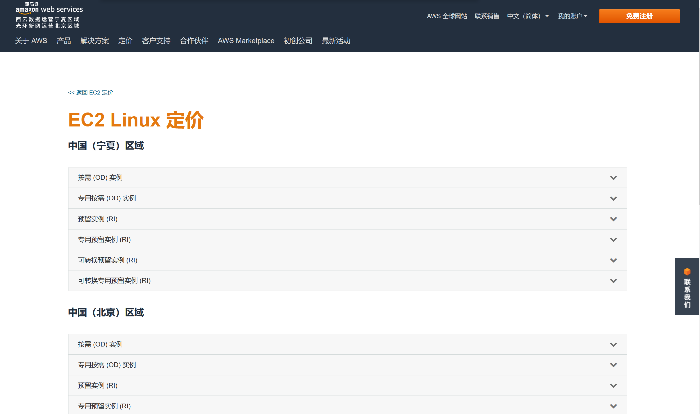
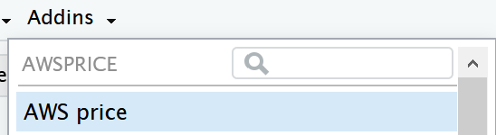
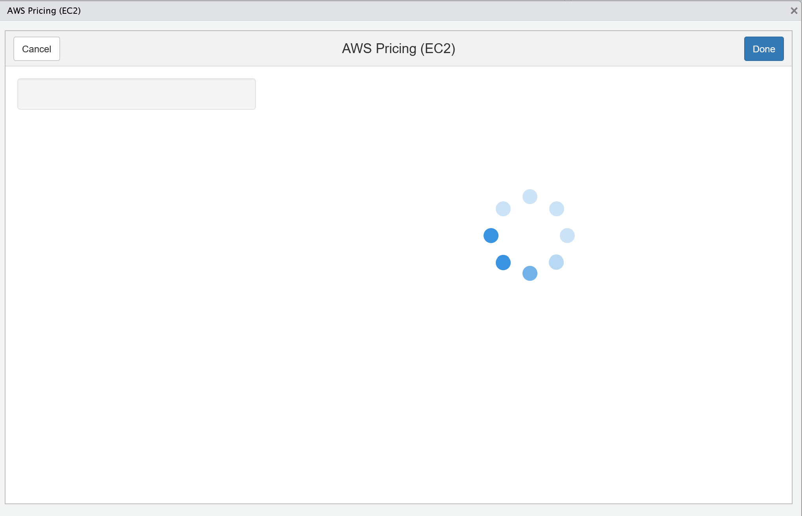
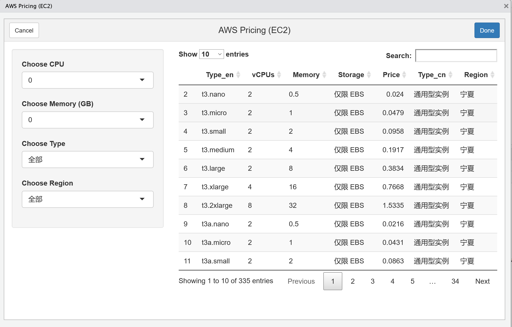

<!-- README.md is generated from README.Rmd. Please edit that file -->

```{r, include = FALSE}
knitr::opts_chunk$set(
  collapse = TRUE,
  comment = "#>",
  fig.path = "man/figures/README-",
  out.width = "100%"
)
```

# awsprice 
<!-- badges: start -->
```{r pressure, echo=FALSE, out.width = '20%'}

```
<!-- badges: end -->

> The goal of awsprice is to search the price of AWS EC2 Linux in [China](https://www.amazonaws.cn/ec2/pricing/ec2-linux-pricing/). 

在选择 AWS EC2 实例类型的时候，价格是我们十分关心的一个因素，但是 AWS 的控制台并没有自动显示价格信息。我们只能在一个静态网页上寻找感兴趣的实例的价格。由于没有查询和排序的功能，使用起来不是很方便。

```{r echo=FALSE, out.width = '80%'}

```

awsprice 是一个基于 [R](http://www.r-project.org/) 语言开发的工具，它可以在 AWS EC2 Linux 的定价网页上提取价格信息，并保存为数据框，供后续查询和分析使用。同时，它也是一个 [RStudio](http://www.rstudio.org/) 的插件，可以通过图形界面来使用。

## 安装方法

在 RStudio 中输入以下命令：

``` r
devtools::install_github("bioxfu/awsprice")
```

如果是 Windows 用户，请先安装 [Rtools](https://mirrors.tuna.tsinghua.edu.cn/CRAN/) 后再执行上面的命令。

## 使用方法
#### 1. 作为 RStudio 的插件来使用:
- 首先在 *Addins* 的下拉菜单中选择 **AWS price** 插件

```{r echo=FALSE, out.width = '50%'}

```
<hr>

- 由于需要在线下载和解析网页，所以请稍作等待

```{r echo=FALSE, out.width = '50%'}

```
<hr>

- 接下来就可以选择你感兴趣的 EC2 实例了

```{r echo=FALSE, out.width = '50%'}

```
<hr>

#### 2. 作为普通的 R 函数使用：
可以用下面的方法保存网页上的价格表。

``` r
tb <- awsprice::fetch_price_table()
```

