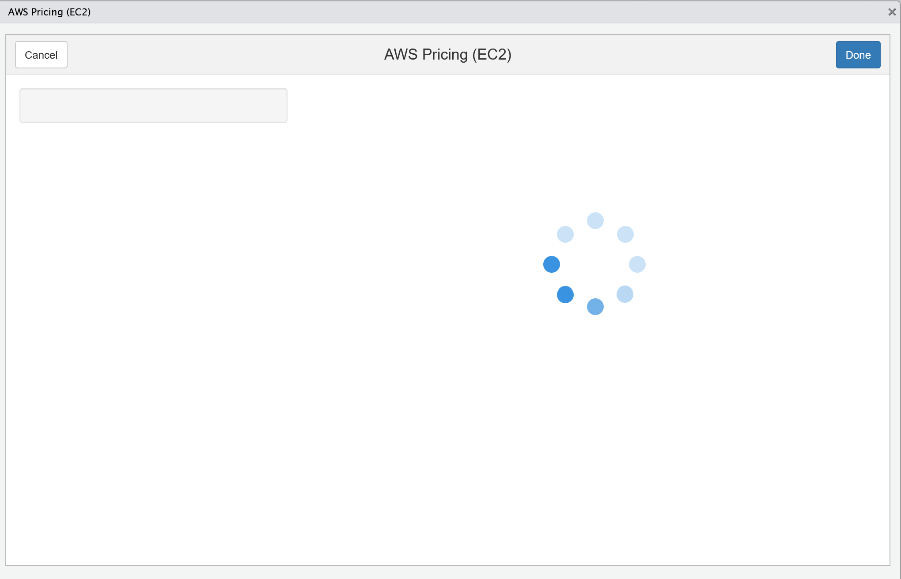
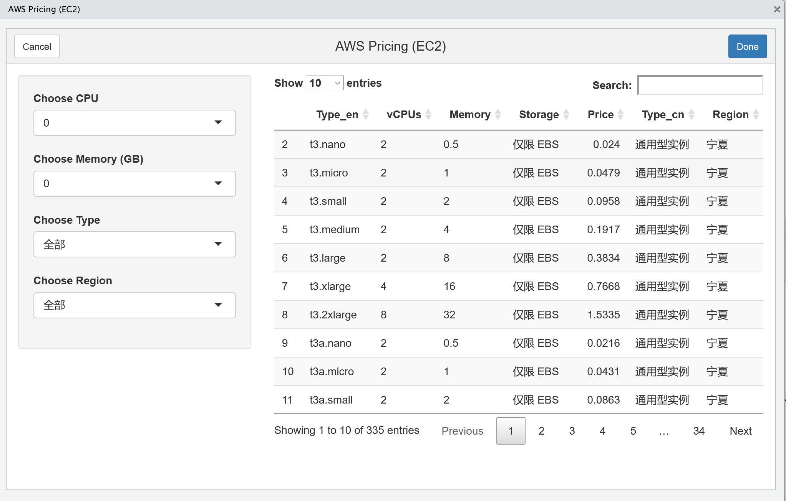

<!-- README.md is generated from README.Rmd. Please edit that file -->

# awsprice

<!-- badges: start -->

<!-- badges: end -->

The goal of awsprice is to search the price of AWS EC2 Linux in
[China](https://www.amazonaws.cn/ec2/pricing/ec2-linux-pricing/).


## Installation

You can install the released version of awsprice from
[GitHub](https://github.com/bioxfu/awsprice) with:

``` r
devtools::install_github("bioxfu/awsprice")
```

## Example

#### 1\. To use awsprice as a RStudio addin:

  - Find **AWS price** in *Addins* pull-down menu


<hr>

  - Wait a minute to download and extract price table



<hr>

  - Start to search the EC2 you need



<hr>

#### 2\. To save the AWS EC2 price table into a data.frame:

``` r
tb <- awsprice::fetch_price_table()
```
